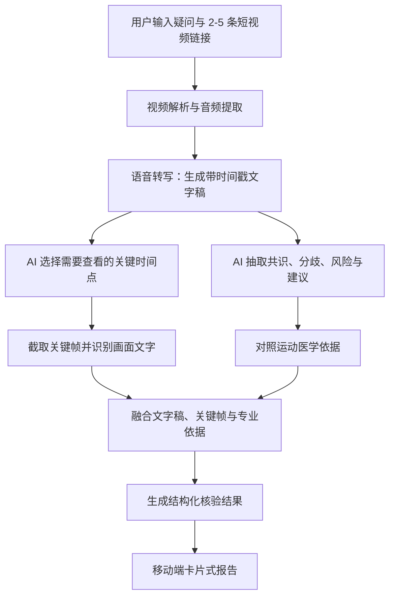

# FitProof 技术说明文档

> 让 AI 替你多看一步：面向运动健康短视频的观点核验与证据辨析系统

## 1. 项目概述

随着“四新”举措锚定“十五五”全民健身高质量发展方向，运动健康内容正在成为大众生活的重要组成部分。项目团队本身也长期关注健身、减脂和运动营养话题，在使用短视频平台时发现，健身人群不断增长的同时，营销号式、绝对化、相互矛盾的运动健康内容也在增加。例如同一话题下，有视频强调“空腹有氧更减脂”，也有视频强调“空腹运动容易掉肌肉”；有视频认为鱼油有健康价值，也有视频直接称其为“智商税”。普通用户很难判断哪些说法可靠、哪些需要条件、哪些可能被夸大。

FitProof 因此定位为一个面向运动健康短视频的 AI 观点核验与证据辨析工具。用户输入一个运动健康疑问，并粘贴 2-5 条相关短视频链接后，系统会自动提取多个视频中的共识、分歧和潜在误导表达，并结合视频出处、关键帧画面信息与运动医学依据，生成一份适合手机端阅读的核验报告。

FitProof 不是运动动作教学工具，也不提供医疗诊断或个体化治疗建议，而是帮助用户把短视频中的碎片化说法整理成更清晰、更可追溯、更便于谨慎理解的判断结果。

【此处插入痛点截图 1：同一运动健康话题下支持某一观点的视频截图】

【此处插入痛点截图 2：同一话题下持相反观点或强调风险的视频截图】

【此处插入痛点截图 3：标题、评论区或营销表达中容易造成误解的截图】

## 2. 产品设计

FitProof 采用手机端优先设计，结果页不是传统长文报告，而是横向滑动的悬浮卡片流。用户可以按“先看结论、再看共识、再看分歧、最后看风险和建议”的路径逐步理解争议内容。

核心页面包括：

- **核验结论**：给出整体判断和证据支持程度。
- **共识基础**：提取多个视频共同认可的内容。
- **分歧诊断**：用左右对话形式展示对立观点，并解释分歧根源。
- **误导风险**：标出可能被夸大、说得过满或存在风险的表达。
- **行动建议**：按不同人群和目标给出谨慎参考建议。
- **AI 答疑**：用户可基于当前报告继续追问。

每张卡片底部提供“查看本页依据”，通过底部抽屉展示本页相关的视频出处、时间点、专业依据和画面识别信息，避免用户只看到 AI 判断却不知道依据来自哪里。

## 3. 技术架构

系统采用前后端分离架构：前端负责手机端输入、横向卡片结果页、依据抽屉和报告导出；后端负责视频解析、音频转写、关键帧截取、OCR 识别和 AI 分析。

### AI 能力使用方式

FitProof 的 AI 能力主要体现在四个环节：

1. **听懂视频**：将视频音频转写为带时间戳的文字稿，保留“观点出自哪条视频、哪个时间点”的可追溯信息。
2. **结构化观点**：把多条视频内容整理为共识、分歧、误导风险和行动建议，避免只生成一段笼统总结。
3. **多看一帧**：根据文字稿中的关键时间点截取视频画面，识别字幕、表格、产品对比图或总结页，补充纯文字稿可能遗漏的信息。
4. **证据校验**：将视频说法与运动医学指南、专业文献和机构建议进行对照，辅助判断哪些说法较可靠、哪些需要条件、哪些可能误导。

其中，“多看一帧”是项目的核心 AI 创新点：AI 不直接依赖完整视频理解，而是利用文字稿时间戳主动定位关键画面，通过关键帧补充视觉信息，从而提升短视频内容理解的完整性。

## 4. 核心实现

用户提交视频链接后，系统先解析视频信息并提取音频，生成带时间戳的文字稿。随后 AI 根据文字稿判断视频中的核心观点、共同认可内容和冲突点，并识别可能需要查看画面的时间位置。系统截取对应关键帧后，通过 OCR 获取画面文字，再与文字稿一起进入最终分析。

最终分析结果不会直接以长文本返回，而是被整理为固定模块：核验结论、共识基础、分歧诊断、误导风险、行动建议和依据来源。前端再将这些模块渲染为手机端卡片流。这样做可以保证不同话题下的结果都有一致的阅读路径，也便于用户快速找到自己关心的内容。

例如在“空腹有氧好不好”的场景中，系统会先判断两个视频是否都认可中低强度有氧对减脂有帮助，再找出它们在“是否必须立即进食”“是否会导致肌肉流失”等问题上的分歧，最后结合专业依据给出不同人群的谨慎建议。

## 5. 作品亮点

- **面向真实争议场景**：聚焦运动健康短视频中的对立观点，而不是简单总结单条视频。
- **关键帧补充理解**：AI 根据时间戳主动截取关键画面，识别字幕、表格和总结信息，体现“让 AI 替你多看一步”。
- **专业依据增强可信度**：结合运动医学指南和专业文献，避免只依赖短视频作者的个人经验。
- **移动端友好呈现**：通过横向卡片流展示结论、共识、分歧、风险和建议，符合手机端阅读习惯。
- **证据可追溯**：每张卡片都能查看本页依据，包括视频出处、时间点、专业依据和画面信息。

## 6. 已知局限与后续规划

当前系统仍存在一些限制：视频解析会受到平台接口和网络环境影响；关键帧理解目前主要依赖 OCR，对复杂图表、动作画面和无文字画面的理解仍有限；专业依据库还需要继续补充文献 URL、年份、证据等级和适用边界。

后续将重点优化三方面：一是扩充运动医学证据库，覆盖减脂、补剂、康复、运动损伤预防等更多场景；二是增强关键帧多模态理解能力，从文字识别扩展到图表和画面语义理解；三是完善移动端体验，增加历史记录、收藏、分享长图和报告导出能力。

FitProof 的目标是让用户面对相互冲突的运动健康短视频时，不再只凭感觉选择相信谁，而是能看到更清晰的观点结构、更可靠的证据来源和更谨慎的行动建议。

